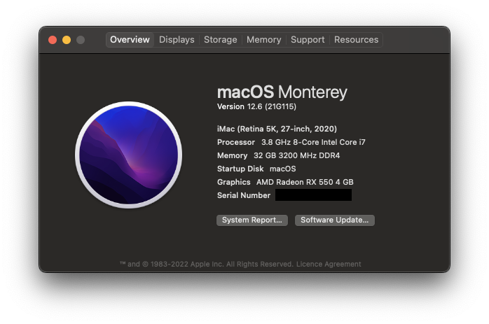

# Intel-i7-10700K_RX-550-Lexa

## Build

| Part | Model |
| --- | --- |
| CPU | Intel Core i7-10700K 3.8 GHz 8-Core Processor |
| Motherboard | MSI MEG Z490 UNIFY ATX LGA1200 Motherboard |
| Video Card | Sapphire PULSE Radeon RX 550 - 512 4 GB Video Card |
| Memory | Kingston HyperX Fury 32 GB (2 x 16 GB) DDR4-3200 CL16 Memory |

## System

Monterey 12.6 (21G115)

OpenCore 0.8.4 (RELEASE)

